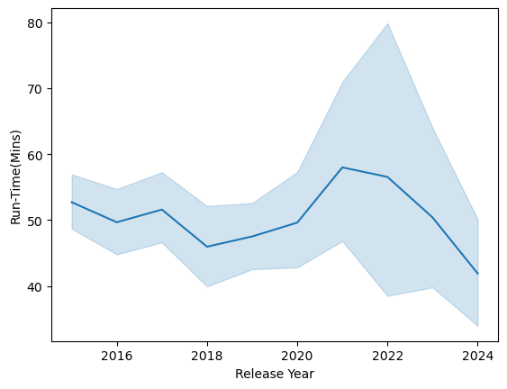
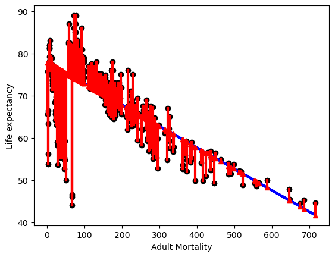

# Top Albums and Runtime with Web Scraping
- This project was very open ended; we had to think of a question that we could solve through web scraping data.
- My question was related to my interests in the music world, friends of mine always said "short pop songs are all that matter" so I wanted to see if album run time varied across the hit albums of the last few years.
- This was a fantastic exercise in actually understanding how data scientists might collect data but also how much is needed to come to a real conclusion, my analysis was good but it was clear I need another piece to this story, data that would show what the average album runtime was to compare.
- It’s also interesting because Taylor swift dominated the charts and had relatively long albums, but that doesn’t mean we should assume she's popular from this alone as there are obviously other factors in play.
- A more interesting rout would be to see if upcoming stars and groups tend to release longer or shorter albums. 

## Question: Does album run time have anything to do with being a top selling album in a year?


```python
import requests
from bs4 import BeautifulSoup
import pandas as pd
import seaborn as sns
```

This is a link to the starting wiki:
[albums](https://en.wikipedia.org/wiki/Top_Album_Sales#2024)

## The bs4 object
After first retreaving and parsing the html I explored the websit using inspect and found 'tbody' was holding the lists of names and links. All the links to the individual albums were wrapped in i tags, using ".a" so we isolate the individual links and names.


```python
albums_url = 'https://en.wikipedia.org/wiki/Top_Album_Sales#2020'
albums_html = requests.get(albums_url).content
cs_albums = BeautifulSoup(albums_html, 'html.parser')
type(cs_albums)
```


    bs4.BeautifulSoup


```python
wiki_content = cs_albums.find_all('tbody')
```


```python
wiki_content[1].find_all('i')
```


    [<i><a class="mw-redirect" href="/wiki/1989_(Taylor_Swift_album)" title="1989 (Taylor Swift album)">1989</a></i>,
     <i><a href="/wiki/2014_Forest_Hills_Drive" title="2014 Forest Hills Drive">2014 Forest Hills Drive</a></i>]


```python
wiki_content[1].find('i').a
```


    <a class="mw-redirect" href="/wiki/1989_(Taylor_Swift_album)" title="1989 (Taylor Swift album)">1989</a>


```python
wiki_content[1].find('i').a.string
```


    '1989'


## Getting consistency
Searching trhrough tags we can scrape a single name, now we can apply this to the entire wiki_content. I define a start to the url since its not included in the href to construct working url's. The next step was isolating the runtime and year released from the constructed link, then applying the method to everything.


```python
album_names = [i.a.string for i in wiki_content[1].find_all('i')]
```


```python
album_names
```


    ['1989', '2014 Forest Hills Drive']


```python
album_names = [i.a.string for name in wiki_content 
               for i in name.find_all('i') 
               if i.a and i.a.string]
```


```python
wiki_content[1].find('i').a
```


    <a class="mw-redirect" href="/wiki/1989_(Taylor_Swift_album)" title="1989 (Taylor Swift album)">1989</a>


```python
wiki_content[1].find('i').a['href']
```


    '/wiki/1989_(Taylor_Swift_album)'


```python
url_start = "https://en.wikipedia.org"
```


```python
test_url = url_start + wiki_content[1].find('i').a['href']
test_url
```


    'https://en.wikipedia.org/wiki/1989_(Taylor_Swift_album)'


## Getting the runtime and year released from the constructed link


```python
test_html = requests.get(test_url).content
test_info = BeautifulSoup(test_html,'html.parser')
```


```python
test_info.find('span', class_="min")
```


    <span class="min">48</span>


```python
test_min = test_info.find('span', class_="min").string
test_min = int(test_min.strip())
test_min
```


    48


```python
test_info.find('span', class_='bday dtstart published updated itvstart').string
```


    '2014-10-27'


```python
test_date = test_info.find('span', class_='bday dtstart published updated itvstart').string
test_date
```


    '2014-10-27'


```python
test_year = test_date.split('-')[0]
test_year
```


    '2014'


## Method to construct Links


```python
album_links = [url_start + i.a['href'] 
               for link in wiki_content 
               for i in link.find_all('i') 
               if i.a and 'href' in i.a.attrs]
```


```python
album_links[1]
```


    'https://en.wikipedia.org/wiki/2014_Forest_Hills_Drive'


## After finding out how to extract the run time I use a loop to do requests through all associated links


```python
album_years = []
run_time = []
time_size = []
```

I also added a time_size catagory to help group by times


```python
for test_url in album_links:
    
    test_html = requests.get(test_url).content
    test_info = BeautifulSoup(test_html,'html.parser')
    try: 
        test_min = test_info.find('span', class_="min").string
        test_date = test_info.find('span', class_='bday dtstart published updated itvstart').string
        test_year = test_date.split('-')[0]
        
        test_year = int(test_year.strip())
        album_years.append(test_year)
        
        test_min = int(test_min.strip())
        run_time.append(test_min)
        
        
        if test_min < 20:
            time_size.append('Very Short')
        elif test_min >= 20 and test_min < 35:
            time_size.append('Short')
        elif test_min >= 35 and test_min < 60:
            time_size.append('Average')
        elif test_min >= 60:
            time_size.append('Long')
        else:
            time_size.append(pd.NA)
    except:
        run_time.append(pd.NA)
        time_size.append(pd.NA)
        album_years.append(pd.NA)
```


```python
albums_df = pd.DataFrame({'Album Name':album_names, 'Release Year':album_years, 'Length Rating':time_size, 'Run-Time(Mins)':run_time,'links':album_links})
```

## I drop all N/A's and duplicates


```python
albums_df
```


<div>
<style scoped>
    .dataframe tbody tr th:only-of-type {
        vertical-align: middle;
    }

    .dataframe tbody tr th {
        vertical-align: top;
    }

    .dataframe thead th {
        text-align: right;
    }
</style>
<table border="1" class="dataframe">
  <thead>
    <tr style="text-align: right;">
      <th></th>
      <th>Album Name</th>
      <th>Release Year</th>
      <th>Length Rating</th>
      <th>Run-Time(Mins)</th>
      <th>links</th>
    </tr>
  </thead>
  <tbody>
    <tr>
      <th>0</th>
      <td>1989</td>
      <td>2014</td>
      <td>Average</td>
      <td>48</td>
      <td>https://en.wikipedia.org/wiki/1989_(Taylor_Swi...</td>
    </tr>
    <tr>
      <th>1</th>
      <td>2014 Forest Hills Drive</td>
      <td>2014</td>
      <td>Long</td>
      <td>64</td>
      <td>https://en.wikipedia.org/wiki/2014_Forest_Hill...</td>
    </tr>
    <tr>
      <th>2</th>
      <td>1989</td>
      <td>2014</td>
      <td>Average</td>
      <td>48</td>
      <td>https://en.wikipedia.org/wiki/1989_(Taylor_Swi...</td>
    </tr>
    <tr>
      <th>3</th>
      <td>Title</td>
      <td>2015</td>
      <td>Short</td>
      <td>32</td>
      <td>https://en.wikipedia.org/wiki/Title_(album)</td>
    </tr>
    <tr>
      <th>4</th>
      <td>American Beauty/American Psycho</td>
      <td>&lt;NA&gt;</td>
      <td>&lt;NA&gt;</td>
      <td>&lt;NA&gt;</td>
      <td>https://en.wikipedia.org/wiki/American_Beauty/...</td>
    </tr>
    <tr>
      <th>...</th>
      <td>...</td>
      <td>...</td>
      <td>...</td>
      <td>...</td>
      <td>...</td>
    </tr>
    <tr>
      <th>444</th>
      <td>Billboard Philippines</td>
      <td>&lt;NA&gt;</td>
      <td>&lt;NA&gt;</td>
      <td>&lt;NA&gt;</td>
      <td>https://en.wikipedia.org/wiki/Billboard_Philip...</td>
    </tr>
    <tr>
      <th>445</th>
      <td>Billboard Türkiye</td>
      <td>&lt;NA&gt;</td>
      <td>&lt;NA&gt;</td>
      <td>&lt;NA&gt;</td>
      <td>https://en.wikipedia.org/wiki/Billboard_T%C3%B...</td>
    </tr>
    <tr>
      <th>446</th>
      <td>Billboard Việt Nam</td>
      <td>&lt;NA&gt;</td>
      <td>&lt;NA&gt;</td>
      <td>&lt;NA&gt;</td>
      <td>https://en.wikipedia.org/wiki/Billboard_Vi%E1%...</td>
    </tr>
    <tr>
      <th>447</th>
      <td>Music &amp; Media</td>
      <td>&lt;NA&gt;</td>
      <td>&lt;NA&gt;</td>
      <td>&lt;NA&gt;</td>
      <td>https://en.wikipedia.org/wiki/Music_%26_Media</td>
    </tr>
    <tr>
      <th>448</th>
      <td>Billboard Radio Monitor</td>
      <td>&lt;NA&gt;</td>
      <td>&lt;NA&gt;</td>
      <td>&lt;NA&gt;</td>
      <td>https://en.wikipedia.org/wiki/Billboard_Radio_...</td>
    </tr>
  </tbody>
</table>
<p>449 rows × 5 columns</p>
</div>


## I start cleaning my data br removing all na's and duplicates


```python
albums_clean_df = albums_df.dropna()
```


```python
albums_clean_df.describe()
```


<div>
<style scoped>
    .dataframe tbody tr th:only-of-type {
        vertical-align: middle;
    }

    .dataframe tbody tr th {
        vertical-align: top;
    }

    .dataframe thead th {
        text-align: right;
    }
</style>
<table border="1" class="dataframe">
  <thead>
    <tr style="text-align: right;">
      <th></th>
      <th>Album Name</th>
      <th>Release Year</th>
      <th>Length Rating</th>
      <th>Run-Time(Mins)</th>
      <th>links</th>
    </tr>
  </thead>
  <tbody>
    <tr>
      <th>count</th>
      <td>355</td>
      <td>355</td>
      <td>355</td>
      <td>355</td>
      <td>355</td>
    </tr>
    <tr>
      <th>unique</th>
      <td>302</td>
      <td>14</td>
      <td>4</td>
      <td>79</td>
      <td>303</td>
    </tr>
    <tr>
      <th>top</th>
      <td>A Star Is Born</td>
      <td>2017</td>
      <td>Average</td>
      <td>48</td>
      <td>https://en.wikipedia.org/wiki/A_Star_Is_Born_(...</td>
    </tr>
    <tr>
      <th>freq</th>
      <td>8</td>
      <td>47</td>
      <td>203</td>
      <td>18</td>
      <td>8</td>
    </tr>
  </tbody>
</table>
</div>


```python
albums_clean_df =albums_clean_df.drop_duplicates()
```


```python
albums_clean_df
```


<div>
<style scoped>
    .dataframe tbody tr th:only-of-type {
        vertical-align: middle;
    }

    .dataframe tbody tr th {
        vertical-align: top;
    }

    .dataframe thead th {
        text-align: right;
    }
</style>
<table border="1" class="dataframe">
  <thead>
    <tr style="text-align: right;">
      <th></th>
      <th>Album Name</th>
      <th>Release Year</th>
      <th>Length Rating</th>
      <th>Run-Time(Mins)</th>
      <th>links</th>
    </tr>
  </thead>
  <tbody>
    <tr>
      <th>0</th>
      <td>1989</td>
      <td>2014</td>
      <td>Average</td>
      <td>48</td>
      <td>https://en.wikipedia.org/wiki/1989_(Taylor_Swi...</td>
    </tr>
    <tr>
      <th>1</th>
      <td>2014 Forest Hills Drive</td>
      <td>2014</td>
      <td>Long</td>
      <td>64</td>
      <td>https://en.wikipedia.org/wiki/2014_Forest_Hill...</td>
    </tr>
    <tr>
      <th>3</th>
      <td>Title</td>
      <td>2015</td>
      <td>Short</td>
      <td>32</td>
      <td>https://en.wikipedia.org/wiki/Title_(album)</td>
    </tr>
    <tr>
      <th>6</th>
      <td>Now 53</td>
      <td>2015</td>
      <td>Long</td>
      <td>74</td>
      <td>https://en.wikipedia.org/wiki/Now_That%27s_Wha...</td>
    </tr>
    <tr>
      <th>7</th>
      <td>If You're Reading This It's Too Late</td>
      <td>2015</td>
      <td>Long</td>
      <td>68</td>
      <td>https://en.wikipedia.org/wiki/If_You%27re_Read...</td>
    </tr>
    <tr>
      <th>...</th>
      <td>...</td>
      <td>...</td>
      <td>...</td>
      <td>...</td>
      <td>...</td>
    </tr>
    <tr>
      <th>428</th>
      <td>F-1 Trillion</td>
      <td>2024</td>
      <td>Average</td>
      <td>57</td>
      <td>https://en.wikipedia.org/wiki/F-1_Trillion</td>
    </tr>
    <tr>
      <th>429</th>
      <td>Days Before Rodeo</td>
      <td>2014</td>
      <td>Average</td>
      <td>50</td>
      <td>https://en.wikipedia.org/wiki/Days_Before_Rodeo</td>
    </tr>
    <tr>
      <th>430</th>
      <td>Crazy</td>
      <td>2024</td>
      <td>Very Short</td>
      <td>14</td>
      <td>https://en.wikipedia.org/wiki/Crazy_(Le_Sseraf...</td>
    </tr>
    <tr>
      <th>431</th>
      <td>Luck and Strange</td>
      <td>2024</td>
      <td>Average</td>
      <td>43</td>
      <td>https://en.wikipedia.org/wiki/Luck_and_Strange</td>
    </tr>
    <tr>
      <th>433</th>
      <td>The Rise and Fall of a Midwest Princess</td>
      <td>2023</td>
      <td>Average</td>
      <td>49</td>
      <td>https://en.wikipedia.org/wiki/The_Rise_and_Fal...</td>
    </tr>
  </tbody>
</table>
<p>304 rows × 5 columns</p>
</div>


```python
albums_clean_df.describe()
```


<div>
<style scoped>
    .dataframe tbody tr th:only-of-type {
        vertical-align: middle;
    }

    .dataframe tbody tr th {
        vertical-align: top;
    }

    .dataframe thead th {
        text-align: right;
    }
</style>
<table border="1" class="dataframe">
  <thead>
    <tr style="text-align: right;">
      <th></th>
      <th>Album Name</th>
      <th>Release Year</th>
      <th>Length Rating</th>
      <th>Run-Time(Mins)</th>
      <th>links</th>
    </tr>
  </thead>
  <tbody>
    <tr>
      <th>count</th>
      <td>304</td>
      <td>304</td>
      <td>304</td>
      <td>304</td>
      <td>304</td>
    </tr>
    <tr>
      <th>unique</th>
      <td>302</td>
      <td>14</td>
      <td>4</td>
      <td>79</td>
      <td>303</td>
    </tr>
    <tr>
      <th>top</th>
      <td>The Album</td>
      <td>2017</td>
      <td>Average</td>
      <td>41</td>
      <td>https://en.wikipedia.org/wiki/Face_the_Sun</td>
    </tr>
    <tr>
      <th>freq</th>
      <td>2</td>
      <td>42</td>
      <td>179</td>
      <td>16</td>
      <td>2</td>
    </tr>
  </tbody>
</table>
</div>


## Removing irrelevant Data 
I noticed we really only get relevant data from starting from 2015, theres not much to comapir from 2014 since only 4 albums are listed and the years below that seem to be dummy variables. 


```python
albums_clean_df['Release Year'].value_counts()
```


    Release Year
    2017    42
    2016    34
    2020    34
    2019    31
    2021    30
    2023    30
    2018    29
    2015    28
    2022    20
    2024    19
    2014     4
    2001     1
    1967     1
    1969     1
    Name: count, dtype: int64


```python
albums_clean_df = albums_clean_df[albums_clean_df['Release Year'] >= 2015]
```


```python
albums_clean_df['Release Year'].value_counts()
```


    Release Year
    2017    42
    2016    34
    2020    34
    2019    31
    2021    30
    2023    30
    2018    29
    2015    28
    2022    20
    2024    19
    Name: count, dtype: int64


```python
albums_clean_df['Length Rating'].value_counts()
```


    Length Rating
    Average       175
    Long           69
    Short          38
    Very Short     15
    Name: count, dtype: int64


```python
albums_clean_df['Run-Time(Mins)'].mean()
```


    50.51851851851852


```python
albums_clean_df.groupby('Length Rating')['Run-Time(Mins)'].mean()
```


    Length Rating
    Average           45.56
    Long          83.057971
    Short         28.052632
    Very Short         15.6
    Name: Run-Time(Mins), dtype: object


```python
sns.lineplot(data=albums_clean_df,x='Release Year', y='Run-Time(Mins)')
```


    <Axes: xlabel='Release Year', ylabel='Run-Time(Mins)'>


    

    


```python
sns.catplot(data=albums_clean_df,x='Release Year', y='Run-Time(Mins)',kind='bar', hue='Length Rating')
```


    <seaborn.axisgrid.FacetGrid at 0x1a0ea0538f0>


    

    


# Summery

Overall, top chart albums stay around 45 minutes.  If we combine counts of small ,very small, and long albums we come to 122 which is still lower than average at 175.  I would say this leads to inconclusive data, if anything this may say more about the amount of work the music indusry puts into projects. Removing duplicates was useful but It would be more useful to observe months in the year to see if theres any dominating artists that write longer or shorter albums.


```python
albums_clean_df.to_csv('Album_Runtime.csv', index=False)
```


```python

```
