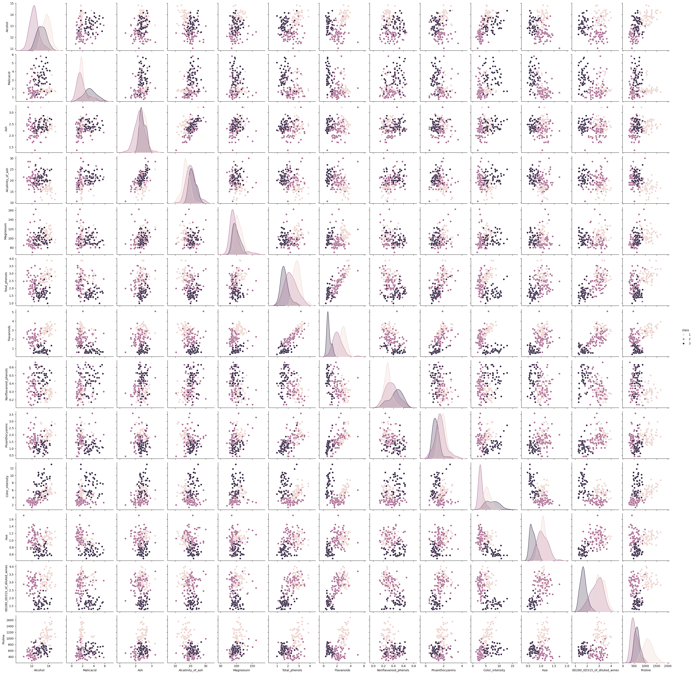

# Wine Classification
In this project we needed to find a data set that was completely numerical.  Through the use of a classification model we were supposed to determine if this could be applied in the real world or if something more complex was required.


```python
import pandas as pd
import seaborn as sns
from sklearn import tree
import numpy as np
from sklearn.model_selection import train_test_split
from sklearn.naive_bayes import GaussianNB
from sklearn.metrics import confusion_matrix 
from sklearn.metrics import classification_report
import matplotlib.pyplot as plt
from sklearn.metrics import confusion_matrix, classification_report, roc_auc_score 
```

[Dataset from here](https://archive.ics.uci.edu/dataset/109/wine)

## Dataset and EDA

This Dataset is contains chemical analysis of wines grown in the same region in Italy but derived from three different cultivars (represented simply as 1-3), these features include color intensity but also alcohol contents and ash which are not visualy determinable.  The task at hand is to determine if wine is from one of the three class's based off of their chemical compounds and looks.


```python
column_names = ["class", "Alcohol", "Malicacid", "Ash", "Alcalinity_of_ash", "Magnesium", "Total_phenols",
                "Flavanoids", "Nonflavanoid_phenols", "Proanthocyanins", "Color_intensity", "Hue", "0D280_0D315_of_diluted_wines", "Proline"]
```


```python
wine_df = pd.read_csv('wine.data', names=column_names)
```


```python
wine_df.head()
```


<div>
<style scoped>
    .dataframe tbody tr th:only-of-type {
        vertical-align: middle;
    }

    .dataframe tbody tr th {
        vertical-align: top;
    }

    .dataframe thead th {
        text-align: right;
    }
</style>
<table border="1" class="dataframe">
  <thead>
    <tr style="text-align: right;">
      <th></th>
      <th>class</th>
      <th>Alcohol</th>
      <th>Malicacid</th>
      <th>Ash</th>
      <th>Alcalinity_of_ash</th>
      <th>Magnesium</th>
      <th>Total_phenols</th>
      <th>Flavanoids</th>
      <th>Nonflavanoid_phenols</th>
      <th>Proanthocyanins</th>
      <th>Color_intensity</th>
      <th>Hue</th>
      <th>0D280_0D315_of_diluted_wines</th>
      <th>Proline</th>
    </tr>
  </thead>
  <tbody>
    <tr>
      <th>0</th>
      <td>1</td>
      <td>14.23</td>
      <td>1.71</td>
      <td>2.43</td>
      <td>15.6</td>
      <td>127</td>
      <td>2.80</td>
      <td>3.06</td>
      <td>0.28</td>
      <td>2.29</td>
      <td>5.64</td>
      <td>1.04</td>
      <td>3.92</td>
      <td>1065</td>
    </tr>
    <tr>
      <th>1</th>
      <td>1</td>
      <td>13.20</td>
      <td>1.78</td>
      <td>2.14</td>
      <td>11.2</td>
      <td>100</td>
      <td>2.65</td>
      <td>2.76</td>
      <td>0.26</td>
      <td>1.28</td>
      <td>4.38</td>
      <td>1.05</td>
      <td>3.40</td>
      <td>1050</td>
    </tr>
    <tr>
      <th>2</th>
      <td>1</td>
      <td>13.16</td>
      <td>2.36</td>
      <td>2.67</td>
      <td>18.6</td>
      <td>101</td>
      <td>2.80</td>
      <td>3.24</td>
      <td>0.30</td>
      <td>2.81</td>
      <td>5.68</td>
      <td>1.03</td>
      <td>3.17</td>
      <td>1185</td>
    </tr>
    <tr>
      <th>3</th>
      <td>1</td>
      <td>14.37</td>
      <td>1.95</td>
      <td>2.50</td>
      <td>16.8</td>
      <td>113</td>
      <td>3.85</td>
      <td>3.49</td>
      <td>0.24</td>
      <td>2.18</td>
      <td>7.80</td>
      <td>0.86</td>
      <td>3.45</td>
      <td>1480</td>
    </tr>
    <tr>
      <th>4</th>
      <td>1</td>
      <td>13.24</td>
      <td>2.59</td>
      <td>2.87</td>
      <td>21.0</td>
      <td>118</td>
      <td>2.80</td>
      <td>2.69</td>
      <td>0.39</td>
      <td>1.82</td>
      <td>4.32</td>
      <td>1.04</td>
      <td>2.93</td>
      <td>735</td>
    </tr>
  </tbody>
</table>
</div>


```python
wine_df.shape
```


    (178, 14)


```python
wine_df.value_counts('class')
```


    class
    2    71
    1    59
    3    48
    Name: count, dtype: int64


```python
feature_vars = ["Alcohol", "Malicacid", "Ash", "Alcalinity_of_ash", "Magnesium", "Total_phenols",
                "Flavanoids", "Nonflavanoid_phenols", "Proanthocyanins", "Color_intensity", "Hue", "0D280_0D315_of_diluted_wines", "Proline"]
target_var = 'class'
```

## Expectations
Looking at the pairplot, using all the columns Id expect Gausssian Naive Bayes to score very high as Alcohol, Malicacid, Flavanoids, and Color_intensity are fairly distinct.


```python
sns.pairplot(data=wine_df,hue=target_var)
```


    <seaborn.axisgrid.PairGrid at 0x21637c388f0>


    

    


## Narrowing options for clarity
This seemed a bit cramped so I made a simpler version for comparisons using some of the more distinct cols


```python
wine_simple_cols = ["class", "Alcohol", "Malicacid", "Color_intensity"]
wine_simple_df = pd.read_csv('wine.data',usecols=[0,1,2,10],names=wine_simple_cols)
wine_simple_df
```


<div>
<style scoped>
    .dataframe tbody tr th:only-of-type {
        vertical-align: middle;
    }

    .dataframe tbody tr th {
        vertical-align: top;
    }

    .dataframe thead th {
        text-align: right;
    }
</style>
<table border="1" class="dataframe">
  <thead>
    <tr style="text-align: right;">
      <th></th>
      <th>class</th>
      <th>Alcohol</th>
      <th>Malicacid</th>
      <th>Color_intensity</th>
    </tr>
  </thead>
  <tbody>
    <tr>
      <th>0</th>
      <td>1</td>
      <td>14.23</td>
      <td>1.71</td>
      <td>5.64</td>
    </tr>
    <tr>
      <th>1</th>
      <td>1</td>
      <td>13.20</td>
      <td>1.78</td>
      <td>4.38</td>
    </tr>
    <tr>
      <th>2</th>
      <td>1</td>
      <td>13.16</td>
      <td>2.36</td>
      <td>5.68</td>
    </tr>
    <tr>
      <th>3</th>
      <td>1</td>
      <td>14.37</td>
      <td>1.95</td>
      <td>7.80</td>
    </tr>
    <tr>
      <th>4</th>
      <td>1</td>
      <td>13.24</td>
      <td>2.59</td>
      <td>4.32</td>
    </tr>
    <tr>
      <th>...</th>
      <td>...</td>
      <td>...</td>
      <td>...</td>
      <td>...</td>
    </tr>
    <tr>
      <th>173</th>
      <td>3</td>
      <td>13.71</td>
      <td>5.65</td>
      <td>7.70</td>
    </tr>
    <tr>
      <th>174</th>
      <td>3</td>
      <td>13.40</td>
      <td>3.91</td>
      <td>7.30</td>
    </tr>
    <tr>
      <th>175</th>
      <td>3</td>
      <td>13.27</td>
      <td>4.28</td>
      <td>10.20</td>
    </tr>
    <tr>
      <th>176</th>
      <td>3</td>
      <td>13.17</td>
      <td>2.59</td>
      <td>9.30</td>
    </tr>
    <tr>
      <th>177</th>
      <td>3</td>
      <td>14.13</td>
      <td>4.10</td>
      <td>9.20</td>
    </tr>
  </tbody>
</table>
<p>178 rows × 4 columns</p>
</div>


```python
feature_vars_simple = ["Alcohol", "Malicacid", "Color_intensity" ]
target_var = 'class'
```


```python
sns.pairplot(data=wine_simple_df,hue=target_var)
```


    <seaborn.axisgrid.PairGrid at 0x2163c09af60>


    

    


## Inspecting Elements and Basic Classification
A closer inspection makes me think class 3 will confuse the model, class 1 and 2 cluster together with some outliers but 3 is all over the place.  Ill split the test size by 20% for more testing


```python
X_train, X_test, y_train, y_test = train_test_split(wine_simple_df[feature_vars_simple],
                                                    wine_simple_df[target_var],
                                                    random_state=5, test_size=0.2)
```


```python
X_train.shape, X_test.shape
```


    ((142, 3), (36, 3))


```python
gnb = GaussianNB()
```


```python
gnb.fit(X_train,y_train)
```


<style>#sk-container-id-2 {
  /* Definition of color scheme common for light and dark mode */
  --sklearn-color-text: black;
  --sklearn-color-line: gray;
  /* Definition of color scheme for unfitted estimators */
  --sklearn-color-unfitted-level-0: #fff5e6;
  --sklearn-color-unfitted-level-1: #f6e4d2;
  --sklearn-color-unfitted-level-2: #ffe0b3;
  --sklearn-color-unfitted-level-3: chocolate;
  /* Definition of color scheme for fitted estimators */
  --sklearn-color-fitted-level-0: #f0f8ff;
  --sklearn-color-fitted-level-1: #d4ebff;
  --sklearn-color-fitted-level-2: #b3dbfd;
  --sklearn-color-fitted-level-3: cornflowerblue;

  /* Specific color for light theme */
  --sklearn-color-text-on-default-background: var(--sg-text-color, var(--theme-code-foreground, var(--jp-content-font-color1, black)));
  --sklearn-color-background: var(--sg-background-color, var(--theme-background, var(--jp-layout-color0, white)));
  --sklearn-color-border-box: var(--sg-text-color, var(--theme-code-foreground, var(--jp-content-font-color1, black)));
  --sklearn-color-icon: #696969;

  @media (prefers-color-scheme: dark) {
    /* Redefinition of color scheme for dark theme */
    --sklearn-color-text-on-default-background: var(--sg-text-color, var(--theme-code-foreground, var(--jp-content-font-color1, white)));
    --sklearn-color-background: var(--sg-background-color, var(--theme-background, var(--jp-layout-color0, #111)));
    --sklearn-color-border-box: var(--sg-text-color, var(--theme-code-foreground, var(--jp-content-font-color1, white)));
    --sklearn-color-icon: #878787;
  }
}

#sk-container-id-2 {
  color: var(--sklearn-color-text);
}

#sk-container-id-2 pre {
  padding: 0;
}

#sk-container-id-2 input.sk-hidden--visually {
  border: 0;
  clip: rect(1px 1px 1px 1px);
  clip: rect(1px, 1px, 1px, 1px);
  height: 1px;
  margin: -1px;
  overflow: hidden;
  padding: 0;
  position: absolute;
  width: 1px;
}

#sk-container-id-2 div.sk-dashed-wrapped {
  border: 1px dashed var(--sklearn-color-line);
  margin: 0 0.4em 0.5em 0.4em;
  box-sizing: border-box;
  padding-bottom: 0.4em;
  background-color: var(--sklearn-color-background);
}

#sk-container-id-2 div.sk-container {
  /* jupyter's `normalize.less` sets `[hidden] { display: none; }`
     but bootstrap.min.css set `[hidden] { display: none !important; }`
     so we also need the `!important` here to be able to override the
     default hidden behavior on the sphinx rendered scikit-learn.org.
     See: https://github.com/scikit-learn/scikit-learn/issues/21755 */
  display: inline-block !important;
  position: relative;
}

#sk-container-id-2 div.sk-text-repr-fallback {
  display: none;
}

div.sk-parallel-item,
div.sk-serial,
div.sk-item {
  /* draw centered vertical line to link estimators */
  background-image: linear-gradient(var(--sklearn-color-text-on-default-background), var(--sklearn-color-text-on-default-background));
  background-size: 2px 100%;
  background-repeat: no-repeat;
  background-position: center center;
}

/* Parallel-specific style estimator block */

#sk-container-id-2 div.sk-parallel-item::after {
  content: "";
  width: 100%;
  border-bottom: 2px solid var(--sklearn-color-text-on-default-background);
  flex-grow: 1;
}

#sk-container-id-2 div.sk-parallel {
  display: flex;
  align-items: stretch;
  justify-content: center;
  background-color: var(--sklearn-color-background);
  position: relative;
}

#sk-container-id-2 div.sk-parallel-item {
  display: flex;
  flex-direction: column;
}

#sk-container-id-2 div.sk-parallel-item:first-child::after {
  align-self: flex-end;
  width: 50%;
}

#sk-container-id-2 div.sk-parallel-item:last-child::after {
  align-self: flex-start;
  width: 50%;
}

#sk-container-id-2 div.sk-parallel-item:only-child::after {
  width: 0;
}

/* Serial-specific style estimator block */

#sk-container-id-2 div.sk-serial {
  display: flex;
  flex-direction: column;
  align-items: center;
  background-color: var(--sklearn-color-background);
  padding-right: 1em;
  padding-left: 1em;
}


/* Toggleable style: style used for estimator/Pipeline/ColumnTransformer box that is
clickable and can be expanded/collapsed.
- Pipeline and ColumnTransformer use this feature and define the default style
- Estimators will overwrite some part of the style using the `sk-estimator` class
*/

/* Pipeline and ColumnTransformer style (default) */

#sk-container-id-2 div.sk-toggleable {
  /* Default theme specific background. It is overwritten whether we have a
  specific estimator or a Pipeline/ColumnTransformer */
  background-color: var(--sklearn-color-background);
}

/* Toggleable label */
#sk-container-id-2 label.sk-toggleable__label {
  cursor: pointer;
  display: block;
  width: 100%;
  margin-bottom: 0;
  padding: 0.5em;
  box-sizing: border-box;
  text-align: center;
}

#sk-container-id-2 label.sk-toggleable__label-arrow:before {
  /* Arrow on the left of the label */
  content: "▸";
  float: left;
  margin-right: 0.25em;
  color: var(--sklearn-color-icon);
}

#sk-container-id-2 label.sk-toggleable__label-arrow:hover:before {
  color: var(--sklearn-color-text);
}

/* Toggleable content - dropdown */

#sk-container-id-2 div.sk-toggleable__content {
  max-height: 0;
  max-width: 0;
  overflow: hidden;
  text-align: left;
  /* unfitted */
  background-color: var(--sklearn-color-unfitted-level-0);
}

#sk-container-id-2 div.sk-toggleable__content.fitted {
  /* fitted */
  background-color: var(--sklearn-color-fitted-level-0);
}

#sk-container-id-2 div.sk-toggleable__content pre {
  margin: 0.2em;
  border-radius: 0.25em;
  color: var(--sklearn-color-text);
  /* unfitted */
  background-color: var(--sklearn-color-unfitted-level-0);
}

#sk-container-id-2 div.sk-toggleable__content.fitted pre {
  /* unfitted */
  background-color: var(--sklearn-color-fitted-level-0);
}

#sk-container-id-2 input.sk-toggleable__control:checked~div.sk-toggleable__content {
  /* Expand drop-down */
  max-height: 200px;
  max-width: 100%;
  overflow: auto;
}

#sk-container-id-2 input.sk-toggleable__control:checked~label.sk-toggleable__label-arrow:before {
  content: "▾";
}

/* Pipeline/ColumnTransformer-specific style */

#sk-container-id-2 div.sk-label input.sk-toggleable__control:checked~label.sk-toggleable__label {
  color: var(--sklearn-color-text);
  background-color: var(--sklearn-color-unfitted-level-2);
}

#sk-container-id-2 div.sk-label.fitted input.sk-toggleable__control:checked~label.sk-toggleable__label {
  background-color: var(--sklearn-color-fitted-level-2);
}

/* Estimator-specific style */

/* Colorize estimator box */
#sk-container-id-2 div.sk-estimator input.sk-toggleable__control:checked~label.sk-toggleable__label {
  /* unfitted */
  background-color: var(--sklearn-color-unfitted-level-2);
}

#sk-container-id-2 div.sk-estimator.fitted input.sk-toggleable__control:checked~label.sk-toggleable__label {
  /* fitted */
  background-color: var(--sklearn-color-fitted-level-2);
}

#sk-container-id-2 div.sk-label label.sk-toggleable__label,
#sk-container-id-2 div.sk-label label {
  /* The background is the default theme color */
  color: var(--sklearn-color-text-on-default-background);
}

/* On hover, darken the color of the background */
#sk-container-id-2 div.sk-label:hover label.sk-toggleable__label {
  color: var(--sklearn-color-text);
  background-color: var(--sklearn-color-unfitted-level-2);
}

/* Label box, darken color on hover, fitted */
#sk-container-id-2 div.sk-label.fitted:hover label.sk-toggleable__label.fitted {
  color: var(--sklearn-color-text);
  background-color: var(--sklearn-color-fitted-level-2);
}

/* Estimator label */

#sk-container-id-2 div.sk-label label {
  font-family: monospace;
  font-weight: bold;
  display: inline-block;
  line-height: 1.2em;
}

#sk-container-id-2 div.sk-label-container {
  text-align: center;
}

/* Estimator-specific */
#sk-container-id-2 div.sk-estimator {
  font-family: monospace;
  border: 1px dotted var(--sklearn-color-border-box);
  border-radius: 0.25em;
  box-sizing: border-box;
  margin-bottom: 0.5em;
  /* unfitted */
  background-color: var(--sklearn-color-unfitted-level-0);
}

#sk-container-id-2 div.sk-estimator.fitted {
  /* fitted */
  background-color: var(--sklearn-color-fitted-level-0);
}

/* on hover */
#sk-container-id-2 div.sk-estimator:hover {
  /* unfitted */
  background-color: var(--sklearn-color-unfitted-level-2);
}

#sk-container-id-2 div.sk-estimator.fitted:hover {
  /* fitted */
  background-color: var(--sklearn-color-fitted-level-2);
}

/* Specification for estimator info (e.g. "i" and "?") */

/* Common style for "i" and "?" */

.sk-estimator-doc-link,
a:link.sk-estimator-doc-link,
a:visited.sk-estimator-doc-link {
  float: right;
  font-size: smaller;
  line-height: 1em;
  font-family: monospace;
  background-color: var(--sklearn-color-background);
  border-radius: 1em;
  height: 1em;
  width: 1em;
  text-decoration: none !important;
  margin-left: 1ex;
  /* unfitted */
  border: var(--sklearn-color-unfitted-level-1) 1pt solid;
  color: var(--sklearn-color-unfitted-level-1);
}

.sk-estimator-doc-link.fitted,
a:link.sk-estimator-doc-link.fitted,
a:visited.sk-estimator-doc-link.fitted {
  /* fitted */
  border: var(--sklearn-color-fitted-level-1) 1pt solid;
  color: var(--sklearn-color-fitted-level-1);
}

/* On hover */
div.sk-estimator:hover .sk-estimator-doc-link:hover,
.sk-estimator-doc-link:hover,
div.sk-label-container:hover .sk-estimator-doc-link:hover,
.sk-estimator-doc-link:hover {
  /* unfitted */
  background-color: var(--sklearn-color-unfitted-level-3);
  color: var(--sklearn-color-background);
  text-decoration: none;
}

div.sk-estimator.fitted:hover .sk-estimator-doc-link.fitted:hover,
.sk-estimator-doc-link.fitted:hover,
div.sk-label-container:hover .sk-estimator-doc-link.fitted:hover,
.sk-estimator-doc-link.fitted:hover {
  /* fitted */
  background-color: var(--sklearn-color-fitted-level-3);
  color: var(--sklearn-color-background);
  text-decoration: none;
}

/* Span, style for the box shown on hovering the info icon */
.sk-estimator-doc-link span {
  display: none;
  z-index: 9999;
  position: relative;
  font-weight: normal;
  right: .2ex;
  padding: .5ex;
  margin: .5ex;
  width: min-content;
  min-width: 20ex;
  max-width: 50ex;
  color: var(--sklearn-color-text);
  box-shadow: 2pt 2pt 4pt #999;
  /* unfitted */
  background: var(--sklearn-color-unfitted-level-0);
  border: .5pt solid var(--sklearn-color-unfitted-level-3);
}

.sk-estimator-doc-link.fitted span {
  /* fitted */
  background: var(--sklearn-color-fitted-level-0);
  border: var(--sklearn-color-fitted-level-3);
}

.sk-estimator-doc-link:hover span {
  display: block;
}

/* "?"-specific style due to the `<a>` HTML tag */

#sk-container-id-2 a.estimator_doc_link {
  float: right;
  font-size: 1rem;
  line-height: 1em;
  font-family: monospace;
  background-color: var(--sklearn-color-background);
  border-radius: 1rem;
  height: 1rem;
  width: 1rem;
  text-decoration: none;
  /* unfitted */
  color: var(--sklearn-color-unfitted-level-1);
  border: var(--sklearn-color-unfitted-level-1) 1pt solid;
}

#sk-container-id-2 a.estimator_doc_link.fitted {
  /* fitted */
  border: var(--sklearn-color-fitted-level-1) 1pt solid;
  color: var(--sklearn-color-fitted-level-1);
}

/* On hover */
#sk-container-id-2 a.estimator_doc_link:hover {
  /* unfitted */
  background-color: var(--sklearn-color-unfitted-level-3);
  color: var(--sklearn-color-background);
  text-decoration: none;
}

#sk-container-id-2 a.estimator_doc_link.fitted:hover {
  /* fitted */
  background-color: var(--sklearn-color-fitted-level-3);
}
</style><div id="sk-container-id-2" class="sk-top-container"><div class="sk-text-repr-fallback"><pre>GaussianNB()</pre><b>In a Jupyter environment, please rerun this cell to show the HTML representation or trust the notebook. <br />On GitHub, the HTML representation is unable to render, please try loading this page with nbviewer.org.</b></div><div class="sk-container" hidden><div class="sk-item"><div class="sk-estimator fitted sk-toggleable"><input class="sk-toggleable__control sk-hidden--visually" id="sk-estimator-id-2" type="checkbox" checked><label for="sk-estimator-id-2" class="sk-toggleable__label fitted sk-toggleable__label-arrow fitted">&nbsp;&nbsp;GaussianNB<a class="sk-estimator-doc-link fitted" rel="noreferrer" target="_blank" href="https://scikit-learn.org/1.4/modules/generated/sklearn.naive_bayes.GaussianNB.html">?<span>Documentation for GaussianNB</span></a><span class="sk-estimator-doc-link fitted">i<span>Fitted</span></span></label><div class="sk-toggleable__content fitted"><pre>GaussianNB()</pre></div> </div></div></div></div>


## General Analysis 
I would say this model makes sense as visual features like color intensity, malic acid content, and alcohol content do correlate to the diffrent class's. The parameters again do fit well as the pairplot above is easy to read, while I still think class 3 will be difficult to parse these features are integrel to wine. 


```python
gnb.score(X_train, y_train)
```


    0.9014084507042254


```python
gnb.score(X_test,y_test)
```


    0.75


```python
confusion_matrix(y_test,y_pred)
```


```python
y_pred = gnb.predict(X_test)
```


```python
n_classes = len(gnb.classes_)
prediction_labels = [['predicted class']*n_classes, gnb.classes_]
actual_labels = [['true class']*n_classes, gnb.classes_]
conf_mat = confusion_matrix(y_test,y_pred)
conf_df = pd.DataFrame(data = conf_mat, index=actual_labels, columns=prediction_labels)
```


```python
conf_df
```


<div>
<style scoped>
    .dataframe tbody tr th:only-of-type {
        vertical-align: middle;
    }

    .dataframe tbody tr th {
        vertical-align: top;
    }

    .dataframe thead tr th {
        text-align: left;
    }
</style>
<table border="1" class="dataframe">
  <thead>
    <tr>
      <th></th>
      <th></th>
      <th colspan="3" halign="left">predicted class</th>
    </tr>
    <tr>
      <th></th>
      <th></th>
      <th>1</th>
      <th>2</th>
      <th>3</th>
    </tr>
  </thead>
  <tbody>
    <tr>
      <th rowspan="3" valign="top">true class</th>
      <th>1</th>
      <td>12</td>
      <td>2</td>
      <td>3</td>
    </tr>
    <tr>
      <th>2</th>
      <td>2</td>
      <td>9</td>
      <td>0</td>
    </tr>
    <tr>
      <th>3</th>
      <td>1</td>
      <td>1</td>
      <td>6</td>
    </tr>
  </tbody>
</table>
</div>


```python
print(classification_report(y_test,y_pred))
```

                  precision    recall  f1-score   support
    
               1       0.80      0.71      0.75        17
               2       0.75      0.82      0.78        11
               3       0.67      0.75      0.71         8
    
        accuracy                           0.75        36
       macro avg       0.74      0.76      0.75        36
    weighted avg       0.76      0.75      0.75        36
    
    

## Classification Report and Confusion Matrix Analysis
Based on the classification report class 3's precision rate is pretty low. This tells me that as the data were to scale up class'3 precision is more likely to drop more and become less reliabe, this would also have an effect on class 1 and 2.  I dont think I would deploy this model baised on these statistics since I couldnt trust its ablility to make a distinction. I would say machine learning could not be used since these statistics, even with the wines more distinct cols the model cant reliably pick out the correct wine. 


```python
dictList = []
```


```python
i = .1
while i <= .9:
    X_train, X_test, y_train, y_test = train_test_split(wine_simple_df[feature_vars_simple],
                                                    wine_simple_df[target_var],
                                                    random_state=5, test_size=i)
    gnb = GaussianNB()
    gnb.fit(X_train,y_train)
    
    train_acc = gnb.score(X_train, y_train)
    test_acc = gnb.score(X_test, y_test)

    dictList.append({
        'train_pct': i,
        'n_train_samples': len(X_train),
        'n_test_samples': len(X_test),
        'train_acc': train_acc,
        'test_acc': test_acc
    })

    i = i + .1
```


```python
percent_df = pd.DataFrame(dictList)
percent_df
```


<div>
<style scoped>
    .dataframe tbody tr th:only-of-type {
        vertical-align: middle;
    }

    .dataframe tbody tr th {
        vertical-align: top;
    }

    .dataframe thead th {
        text-align: right;
    }
</style>
<table border="1" class="dataframe">
  <thead>
    <tr style="text-align: right;">
      <th></th>
      <th>train_pct</th>
      <th>n_train_samples</th>
      <th>n_test_samples</th>
      <th>train_acc</th>
      <th>test_acc</th>
    </tr>
  </thead>
  <tbody>
    <tr>
      <th>0</th>
      <td>0.1</td>
      <td>160</td>
      <td>18</td>
      <td>0.881250</td>
      <td>0.722222</td>
    </tr>
    <tr>
      <th>1</th>
      <td>0.2</td>
      <td>142</td>
      <td>36</td>
      <td>0.901408</td>
      <td>0.750000</td>
    </tr>
    <tr>
      <th>2</th>
      <td>0.3</td>
      <td>124</td>
      <td>54</td>
      <td>0.911290</td>
      <td>0.796296</td>
    </tr>
    <tr>
      <th>3</th>
      <td>0.4</td>
      <td>106</td>
      <td>72</td>
      <td>0.915094</td>
      <td>0.805556</td>
    </tr>
    <tr>
      <th>4</th>
      <td>0.5</td>
      <td>89</td>
      <td>89</td>
      <td>0.898876</td>
      <td>0.831461</td>
    </tr>
    <tr>
      <th>5</th>
      <td>0.6</td>
      <td>71</td>
      <td>107</td>
      <td>0.901408</td>
      <td>0.831776</td>
    </tr>
    <tr>
      <th>6</th>
      <td>0.7</td>
      <td>53</td>
      <td>125</td>
      <td>0.924528</td>
      <td>0.824000</td>
    </tr>
    <tr>
      <th>7</th>
      <td>0.8</td>
      <td>35</td>
      <td>143</td>
      <td>0.942857</td>
      <td>0.790210</td>
    </tr>
    <tr>
      <th>8</th>
      <td>0.9</td>
      <td>17</td>
      <td>161</td>
      <td>1.000000</td>
      <td>0.782609</td>
    </tr>
  </tbody>
</table>
</div>


## Overfitting issues
I can see here that the training accuracy is usuually much higher than test accuracy,  this makes me question if the model is getting better with figuring out patterns or is simply just recognizing data its been given. At 90% it gets a 100% score but in test accuracy isnt even the highest score of that catagory.  The test accuracy does go up when we give it more data but seems to drop off at 30%.  From 30% we see it boosts to a high of 83% but also drops back to 78% which makes me question if giving it more data actually does help it.
