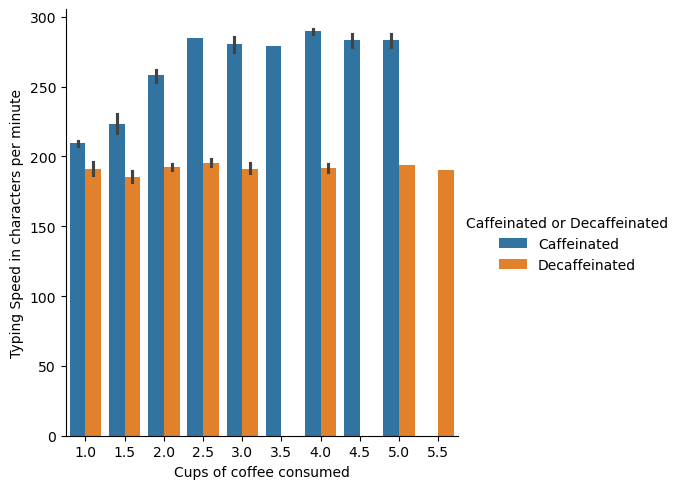
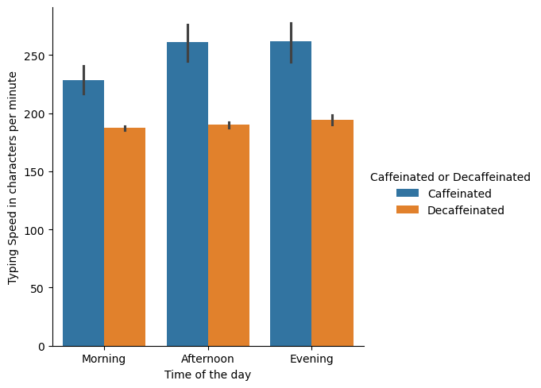
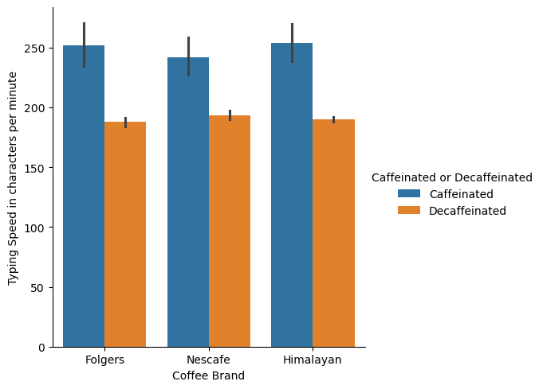

# Quality Testing and Visuals

- In this project I picked a previous dataset to explore.
- My conclusion was this coffee data was interesring but lacked depth.
- We had to come up with three questions and then answer them with supporting information.
- This was also our intro to using **seaborn** to give visual aid to my explanations.

# Description

This data seems to show that caffeinated coffee can improve typing speed but is missing some useful information to prove coffee's use as a stimulant.  What’s interesting is there is no context on the size, gender, or age of the person so we don’t really know what group of people these effects. It’s reasonable to assume decaf coffee was used as a placebo instead of having a contestant drink water or nothing, making it a good comparison.  It’s also strange that serving size is not given since brands could have more caffeine per cup. Overall, this data is to generalized to show a direct connection to typing speed, I believe more information on the participants would help determine a better correlation. 


```python
import pandas as pd
import seaborn as sns
```


```python
coffee_df = pd.read_excel('https://eazyml.com/documents/Coffee%20As%20A%20Stimulant%20-%20Training%20Data.xlsx')
```

This is a simple data set to see if coffee consumption shows any relation to how fast a person can type.
It gives information on whether the coffee was caffeinated, how many cups were drank, brand, time of day, and the typing speed. The source of this data is incredibly vague on context and provides no real useful details. 


```python
coffee_df
```


<div>
<style scoped>
    .dataframe tbody tr th:only-of-type {
        vertical-align: middle;
    }

    .dataframe tbody tr th {
        vertical-align: top;
    }

    .dataframe thead th {
        text-align: right;
    }
</style>
<table border="1" class="dataframe">
  <thead>
    <tr style="text-align: right;">
      <th></th>
      <th>Cups of coffee consumed</th>
      <th>Caffeinated or Decaffeinated</th>
      <th>Coffee Brand</th>
      <th>Time of the day</th>
      <th>Typing Speed in characters per minute</th>
    </tr>
  </thead>
  <tbody>
    <tr>
      <th>0</th>
      <td>2.0</td>
      <td>Caffeinated</td>
      <td>Folgers</td>
      <td>Morning</td>
      <td>260</td>
    </tr>
    <tr>
      <th>1</th>
      <td>1.0</td>
      <td>Caffeinated</td>
      <td>Folgers</td>
      <td>Morning</td>
      <td>205</td>
    </tr>
    <tr>
      <th>2</th>
      <td>1.0</td>
      <td>Decaffeinated</td>
      <td>Folgers</td>
      <td>Morning</td>
      <td>183</td>
    </tr>
    <tr>
      <th>3</th>
      <td>2.0</td>
      <td>Caffeinated</td>
      <td>Nescafe</td>
      <td>Morning</td>
      <td>247</td>
    </tr>
    <tr>
      <th>4</th>
      <td>1.0</td>
      <td>Caffeinated</td>
      <td>Nescafe</td>
      <td>Morning</td>
      <td>211</td>
    </tr>
    <tr>
      <th>...</th>
      <td>...</td>
      <td>...</td>
      <td>...</td>
      <td>...</td>
      <td>...</td>
    </tr>
    <tr>
      <th>78</th>
      <td>1.0</td>
      <td>Decaffeinated</td>
      <td>Himalayan</td>
      <td>Evening</td>
      <td>198</td>
    </tr>
    <tr>
      <th>79</th>
      <td>1.5</td>
      <td>Decaffeinated</td>
      <td>Folgers</td>
      <td>Morning</td>
      <td>185</td>
    </tr>
    <tr>
      <th>80</th>
      <td>1.5</td>
      <td>Decaffeinated</td>
      <td>Himalayan</td>
      <td>Morning</td>
      <td>191</td>
    </tr>
    <tr>
      <th>81</th>
      <td>1.5</td>
      <td>Decaffeinated</td>
      <td>Nescafe</td>
      <td>Afternoon</td>
      <td>187</td>
    </tr>
    <tr>
      <th>82</th>
      <td>1.5</td>
      <td>Decaffeinated</td>
      <td>Folgers</td>
      <td>Evening</td>
      <td>186</td>
    </tr>
  </tbody>
</table>
<p>83 rows × 5 columns</p>
</div>


Just getting all of the columns


```python
coffee_df.columns
```


    Index(['Cups of coffee consumed', 'Caffeinated or Decaffeinated',
           'Coffee Brand', 'Time of the day',
           'Typing Speed in characters per minute'],
          dtype='object')


## Question 1: Does caffeinated coffee outperform decaffeinated coffee as a stimulant?

The data below suggests those who drink caffeinated coffee perform better. Even in those who drank more coffee its clear that caffinated out preformed. Its also intersting to note that drinking past 2.5 cups has no real effect on typing speed.


```python
coffee_df.groupby('Caffeinated or Decaffeinated')['Typing Speed in characters per minute'].describe()
```


<div>
<style scoped>
    .dataframe tbody tr th:only-of-type {
        vertical-align: middle;
    }

    .dataframe tbody tr th {
        vertical-align: top;
    }

    .dataframe thead th {
        text-align: right;
    }
</style>
<table border="1" class="dataframe">
  <thead>
    <tr style="text-align: right;">
      <th></th>
      <th>count</th>
      <th>mean</th>
      <th>std</th>
      <th>min</th>
      <th>25%</th>
      <th>50%</th>
      <th>75%</th>
      <th>max</th>
    </tr>
    <tr>
      <th>Caffeinated or Decaffeinated</th>
      <th></th>
      <th></th>
      <th></th>
      <th></th>
      <th></th>
      <th></th>
      <th></th>
      <th></th>
    </tr>
  </thead>
  <tbody>
    <tr>
      <th>Caffeinated</th>
      <td>42.0</td>
      <td>249.642857</td>
      <td>32.771062</td>
      <td>205.0</td>
      <td>213.25</td>
      <td>257.5</td>
      <td>282.75</td>
      <td>291.0</td>
    </tr>
    <tr>
      <th>Decaffeinated</th>
      <td>41.0</td>
      <td>190.487805</td>
      <td>6.344769</td>
      <td>176.0</td>
      <td>187.00</td>
      <td>190.0</td>
      <td>194.00</td>
      <td>214.0</td>
    </tr>
  </tbody>
</table>
</div>


```python
sns.catplot(data=coffee_df,x='Cups of coffee consumed', y='Typing Speed in characters per minute',kind='bar', hue='Caffeinated or Decaffeinated',)
```


    <seaborn.axisgrid.FacetGrid at 0x1c1eabb5c10>


    

    


## Question 2: Are the effects of coffee consistent across different times of the day?

Judging the data below, the morning seems to slow people down but tends to even out in the afternoon.


```python
coffee_df.groupby('Time of the day')['Typing Speed in characters per minute'].mean()
```


    Time of the day
    Afternoon    219.344828
    Evening      230.285714
    Morning      211.000000
    Name: Typing Speed in characters per minute, dtype: float64


```python
sns.catplot(data=coffee_df,x='Time of the day', y='Typing Speed in characters per minute',kind='bar', hue='Caffeinated or Decaffeinated')
```


    <seaborn.axisgrid.FacetGrid at 0x1c1ead8f0e0>


    

    


## Question 3: Do certain coffee brands lead to better performance?

While the graphs show a slight dip for Nescafe its a negligible amount. From this data set Id say these brands at least have similar effects.


```python
sns.catplot(data=coffee_df,x='Coffee Brand', y='Typing Speed in characters per minute',kind='bar', hue='Caffeinated or Decaffeinated')
```


    <seaborn.axisgrid.FacetGrid at 0x1c1eaced1f0>


    

    


```python
coffee_df.groupby('Coffee Brand')['Typing Speed in characters per minute'].mean()
```


    Coffee Brand
    Folgers      222.583333
    Himalayan    221.843750
    Nescafe      216.814815
    Name: Typing Speed in characters per minute, dtype: float64


## Future analysis 

This data really is lacking.  I feel for a future analysis more demographic info on participants is absolutely required.  While we can determine in these cases people who drank caffeinated coffee out preformed others we have no Idea who were comparing too.  Theres no age, size, or any information that could tell us who coffee does work on.  


```python

```
